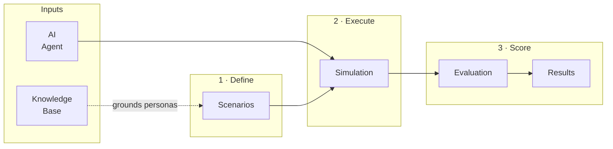
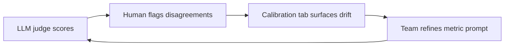

## What is Arkdock?

You've built an AI agent. Now how do you know it actually works for real users before you ship it? Arkdock gives teams a central place to connect their agents, define realistic test scenarios, run multi-turn simulations, and score agent performance with LLM-judged evaluation metrics — all without writing test infrastructure from scratch.

The platform is built around a three-step workflow:

1. **Scenarios** describe who your simulated users are, what they want, and what they know.
2. **Simulations** run those scenarios against a connected agent and produce full conversation transcripts.
3. **Evaluations** score the transcripts using quantitative and qualitative metrics, and detect behavioral failures. Teams can define **custom metrics** for domain-specific behaviors and use **annotations** to correct LLM judge scores they disagree with, feeding a calibration loop that brings automated scoring in line with human judgment over time.

---

## Who is it for?

Arkdock is built for teams that build and operate AI agents:

- **AI engineers** who want to catch regressions before deploying a new agent version.
- **QA teams** who need structured, repeatable test coverage across a wide range of user intents.
- **Product teams** who want visibility into how well their agent serves users in realistic conditions.

No testing infrastructure or scripting experience is required. Arkdock handles scenario execution, conversation management, and evaluation scoring through the UI.

---

## Common use cases

- **Regression testing before a release** — Run the same scenario set against each new agent version to catch capability regressions before they reach users.
- **Comparing two system prompts** — Connect both variants as separate agents, run identical simulations, and compare scores side by side.
- **Establishing a quality baseline** — Run a broad evaluation on your current agent to set a score floor that future releases must meet or beat.

---

## What makes it different?

### Any agent, any framework

Connect agents built with any framework (LangChain, CrewAI, OpenAI Agents SDK, custom code) through a standard Chat Completions or A2A API endpoint. No SDK to install in your agent codebase.

### Realistic, multi-turn testing

Simulations play out as full conversations, not single-turn probes. Each simulated user follows a defined persona and goal across multiple turns, producing transcripts that reflect real-world interaction patterns.

### LLM-judged evaluation

Evaluations use an LLM judge to score conversations on built-in and custom metrics. Scores are computed at the conversation and metric level so you can compare runs, track regressions, and prioritize fixes.

### Custom metrics for domain-specific behaviors

Seven built-in metrics cover general agent quality, but every product has behaviors no generic rubric captures. Teams can define custom metrics in plain language — write a scoring prompt describing what good and bad look like on a 1-5 scale, and the LLM judge applies it from the next evaluation onward. Custom metrics are versioned, reusable across evaluations, and mix freely with built-ins.

### Human-in-the-loop calibration

When the team disputes an LLM judge score, reviewers can enter their own score in the **Annotations** tab without overwriting the original. The **Annotation Calibration** tab then shows agreement rates per metric, surfaces the most common disagreements, and links back to each disputed turn — giving teams the evidence they need to refine a metric's prompt and close the gap between automated scoring and human judgment.

---

## FAQ

<AccordionGroup>
  <Accordion title="What agent types does Arkdock support?">
    Arkdock supports two integration types: Chat Completions (any endpoint that follows the OpenAI `/chat/completions` schema) and A2A (Agent-to-Agent protocol). Most agents built on popular frameworks can be connected via the Chat Completions endpoint with no code changes.
  </Accordion>
  <Accordion title="Does Arkdock require changes to my agent code?">
    No. Arkdock calls your agent over HTTP. As long as your agent exposes a compatible endpoint, no changes are needed in your agent codebase.
  </Accordion>
  <Accordion title="How are API keys and headers stored?">
    Header values (typically used for API keys and auth tokens) are encrypted at rest. The platform displays masked values and never returns the raw secret after it is saved.
  </Accordion>
  <Accordion title="What is the difference between a simulation and an evaluation?">
    A simulation is the execution layer: it runs scenarios against your agent and produces conversation transcripts. An evaluation is the scoring layer: it takes one or more completed simulations and scores the transcripts using an LLM judge.
  </Accordion>
  <Accordion title="Can multiple team members annotate the same evaluation?">
    Yes. Multiple reviewers can annotate turns independently. Admins can toggle to a view that shows all reviewers' annotations alongside the auto-evaluation scores and the resolved values used for calibration.
  </Accordion>
</AccordionGroup>

---

## Quick links

<CardGroup cols={2}>
  <Card title="Quick Start" icon="bolt" href="/quickstart">
    Connect your first agent and run a simulation in minutes.
  </Card>
  <Card title="Agents" icon="robot" href="/agents">
    Connect and configure AI agents for testing.
  </Card>
  <Card title="Scenarios" icon="users" href="/scenarios">
    Define the simulated users that drive conversations.
  </Card>
  <Card title="Simulations" icon="flask" href="/simulations">
    Run scenarios against agents and capture transcripts.
  </Card>
  <Card title="Evaluations" icon="chart-bar" href="/evaluations">
    Score transcripts with LLM judges and metrics.
  </Card>
  <Card title="Annotations" icon="pen" href="/annotations">
    Add human judgment to calibrate automated scores.
  </Card>
</CardGroup>
