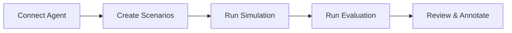

Arkdock is built around the workflow below. Whether you are a PM validating that a new agent version still handles your top user journeys, or a QA engineer building repeatable test coverage across personas and edge cases, each step maps directly to a page in the platform.

<Note>
  **Onboarding checklist** — After you log in for the first time, an **Onboarding Checklist** widget appears in the left sidebar showing five steps: Connect your agent, Generate scenarios, Run a simulation, Run an evaluation, and Set up metrics. Each step is automatically checked off as you complete it. The checklist disappears once all five are done. Use it to track your progress through this guide.
</Note>

---

## Step 1: Create an account

Go to the Arkdock sign-up page and create an account with your work email. After submitting the form you will receive a verification email. Click the link in that email to activate your account and land on the platform.

If your team already has an Arkdock organization, ask an admin to send you an invite link instead of signing up directly. Invite links automatically join you to the existing organization.

---

## Step 2: Connect an agent

Navigate to **Agents** in the left sidebar and click **Connect Agent**.

Fill in the form:

| Field | What to enter |
|---|---|
| Agent name | A descriptive name (e.g. "Customer Support v2") |
| API Type | `Chat Completions` for most agents, `A2A` for Agent-to-Agent protocol |
| Endpoint URL | The full URL Arkdock will POST conversations to |
| Headers | Any auth headers your endpoint requires (e.g. `Authorization: Bearer <token>`). Values are encrypted at rest. |
| Body | Default parameters or system messages your endpoint expects |

Click **Test Connection** to verify the endpoint responds before saving. A green checkmark confirms the connection works. Click **Connect Agent** to save.

<Frame>
  
</Frame>

---

## Step 3: Add scenarios

Navigate to **Scenarios** and click **Generate Scenarios** (or **Import** if you have an existing scenario file).

To generate scenarios with AI:

<Steps>
  <Step title="Describe your agent">
    Describe your agent and the kinds of users it serves.
  </Step>
  <Step title="Review generated scenarios">
    Arkdock generates a set of scenario personas, each with a user goal and profile.
  </Step>
  <Step title="Save to a group">
    Review and edit the generated scenarios, then save them to a scenario group.
  </Step>
</Steps>

Each scenario represents one type of simulated user. A scenario group organizes related scenarios together (e.g. all scenarios for a specific product line or support topic).

---

## Step 4: Run a simulation

Navigate to **Simulations** and click **New Simulation**.

<Steps>
  <Step title="Select agent">
    Select the agent you connected in Step 2.
  </Step>
  <Step title="Name the simulation">
    Give the simulation a descriptive name.
  </Step>
  <Step title="Select scenarios">
    Select the scenarios to include.
  </Step>
  <Step title="Configure conversation settings">
    Set **Conversations per scenario** (default: 1, capped so total conversations stay at or below 50) and **Max turns per conversation** (default: 5, max 10).
  </Step>
  <Step title="Run">
    Click **Run Simulation**.
  </Step>
</Steps>

<Frame>
  
</Frame>

Arkdock will navigate you to the simulation detail page. Each row in the conversations table represents one simulated conversation. Click any row to read the full transcript.

---

## Step 5: Run an evaluation

Once the simulation status shows **Completed**, navigate to **Evaluations** and click **New Evaluation**.

<Steps>
  <Step title="Select simulation">
    **Simulation** — Select the simulation you just ran.
  </Step>
  <Step title="Select metrics">
    **Metrics** — Select the metrics to score. **Goal Completion is always included.** Add Helpfulness, Coherence, or any custom metrics you care about.
  </Step>
  <Step title="Run">
    Click **Run Evaluation**.
  </Step>
</Steps>

Arkdock scores each conversation turn and updates the status to Completed when done. Click the evaluation row to open the detail page.

---

## Step 6: Review results

The evaluation detail page breaks results into four sections:

- **Quantitative Metrics** — numeric scores per metric, grouped into turn-level and conversation-level, with band labels (Excellent, Good, Needs Improvement, Poor).
- **Qualitative Metrics** — label distributions for categorical metrics.
- **Unique Errors** — behavioral failures detected by the LLM judge, grouped by severity with suggested fixes.
- **Conversations** — the full list of scored conversations with per-conversation scores and status.

<Frame>
  
</Frame>

Click any conversation row to open the transcript modal. Expand the **Reasoning** panel on each assistant turn to read the LLM judge's explanation for that score.

---

## Step 7: Invite your team

Evaluation results are more useful when the whole team can review them. Navigate to **Settings** in the sidebar, then open the **Members** tab.

Click **Invite Member** and enter your teammate's work email. They receive an invitation link that joins them to your organization. If they do not have an Arkdock account yet, they are prompted to create one on acceptance.

Roles determine what each member can do:

| Role | What they can do |
|---|---|
| **Owner** | Full access including member management and billing |
| **Member** | Access to agents, scenarios, simulations, evaluations, knowledge, and metrics |

Once teammates are in, they can annotate evaluation turns in the **Annotations** tab to calibrate LLM judge scores against human judgment. Admins can toggle the **Admin view** in an evaluation to see all reviewers' annotations alongside the auto-evaluation scores.

---

## Step 8: Monitor token usage and billing

Arkdock bills by token consumption. Navigate to **Settings > Billing** to see your current plan, token usage for the billing period, and any overage charges.

### Plans

| Plan | Price | Best for |
|---|---|---|
| **Free** | $0/month | Getting started and early exploration |
| **Pro** | $299/month | Teams running production workloads |
| **Enterprise** | Custom | Organizations with custom scale or compliance needs |

### Token dimensions

Every simulation (input/output to your agent and the LLM judge) and every knowledge indexing operation consumes tokens. The Billing tab shows three meters:

| Dimension | Resets | Free allowance | Pro allowance |
|---|---|---|---|
| **Input tokens** | Each billing period | 700K | 14M |
| **Output tokens** | Each billing period | 100K | 2M |
| **Knowledge tokens** | Never (lifetime hard limit) | 5K | 100K |

The progress bar for each dimension turns amber at 80% and red at 100%. On the Free plan, operations pause when any limit is reached — no overage is charged. On Pro, operations continue and overage is billed at $0.01 per 1K input tokens and $0.05 per 1K output tokens, up to a default ceiling of $2,000 per month. You can set a lower **Spending Cap** on the Billing tab to prevent unexpected charges.

<Frame>
   Billing — plan comparison, token usage meters for the current period, and the spending cap control." />
</Frame>

To upgrade, click **Upgrade to Pro** on the Billing tab. To manage your payment method or download invoices, click **Manage Billing** (opens the Stripe billing portal).

---

## Next steps

- [Add more agents](/agents) to compare multiple agent versions.
- [Customize metrics](/metrics) to score domain-specific behaviors.
- [Upload knowledge documents](/knowledge) to give your simulated users access to product docs or FAQs.
